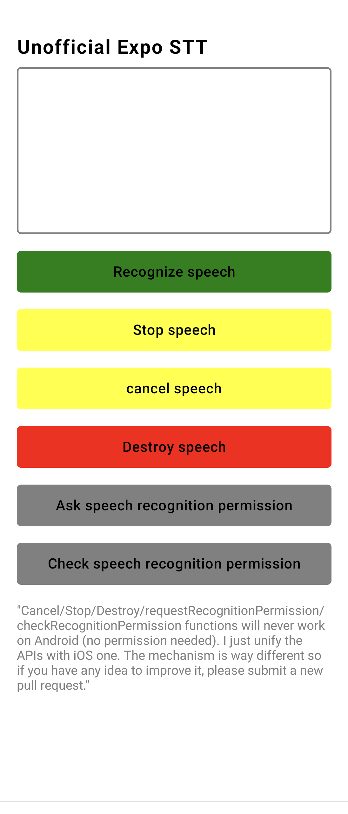

# Unofficial Expo Speech To Text module

This module just support iOS and Android platforms.

So sorry that I am unemployed and don't have much money to spend more time to make this module work also for web.

If you still want to support web platform, please follow this article https://developer.mozilla.org/en-US/docs/Web/API/Web_Speech_API/Using_the_Web_Speech_API



## Installation

```
npx expo install expo-stt
```

## Custom Permissions strings

Add this line to the plugins under `app.json` to custom permissions string for iOS. We don't need any extra permission for Android.

```
  "plugins": [
    [
      "expo-stt",
      {
        "microphonePermission": "Allow $(PRODUCT_NAME) to access your microphone",
        "speechRecognitionPermission": "Allow $(PRODUCT_NAME) to access your speech recognition"
      }
    ]
  ]
```

## Usage

Please go into `example/App.tsx` to follow the instruction.

## Why?

A module for Expo, why not?

## Contribute

Any idea to make this module more stable and flexible are welcome.
Don't hesitate to shot me an email to anhtuank7c@hotmail.com or submit a PR, both way works for me.

## Author

I am looking for a job as a React native developer, remote work is preferred.

Check out my CV: https://anhtuank7c.github.io
